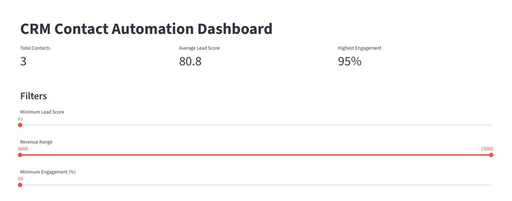
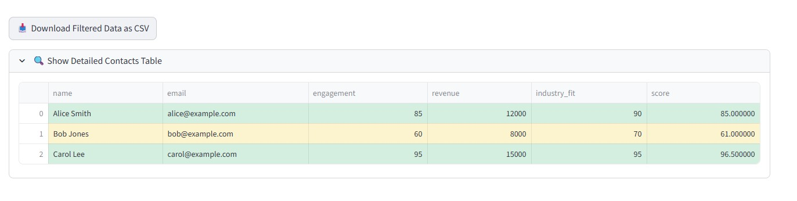
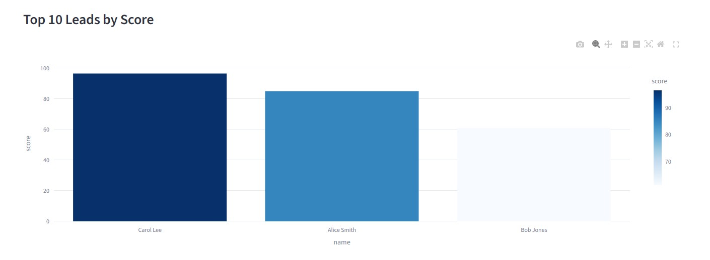
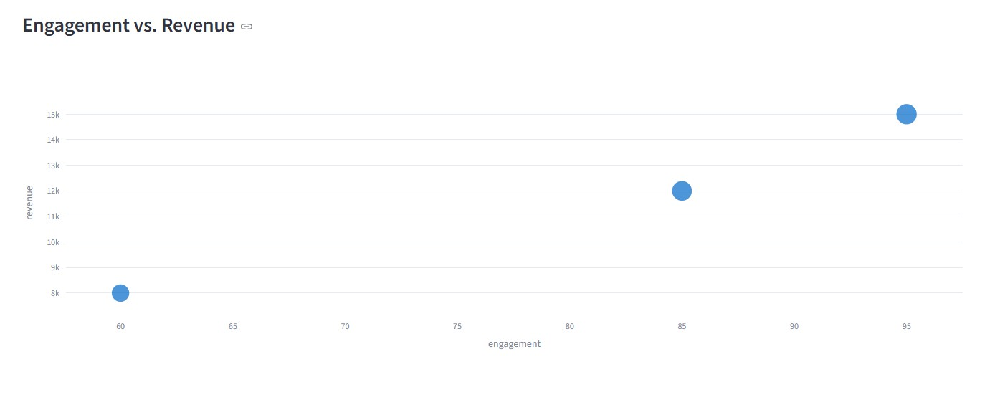

# CRM Contact Automation Tool

A Python-based automation tool designed to streamline contact updates and lead scoring in CRM systems. This project helps reduce manual data entry, improve lead prioritization, and ensure consistent data synchronization across platforms.

## 🚀 Features

- Parses contact data from CSV or JSON files
- Applies a customizable lead scoring algorithm
- Sends updates to CRM via REST API integration
- Logs successful updates and errors for auditing
- Configurable scoring weights and thresholds

## 🛠️ Tech Stack

- Python 3.10
- Pandas
- Requests
- REST API
- GitHub Actions (CI/CD)
- JSON/CSV data formats

## 📸 Interactive Filters Demo

Below is a preview of the new filter controls in action. Move the sliders to dynamically update the table and charts.

## 📸 Interactive Filters Demo

*Above is a preview of the new filter controls in action. Move the sliders to dynamically update the table and charts.*

## 📸 Detailed Contacts Table

*This collapsible table view shows all scored contacts with conditional row-coloring:  
green for high-score (≥ 80), yellow for medium (50–79), and red for low (< 50).  
Use the sliders above to filter by score, revenue, and engagement in real time.*

## 📈 Top 10 Leads by Score

*This bar chart ranks the top ten contacts by their computed lead score, spotlighting the highest-potential leads. Hover over any bar to see email address, industry fit, revenue, and engagement details.*  

## 📊 Engagement vs Revenue

*Scatter plot illustrating each contact’s engagement percentage against revenue.  
Bubble size indicates industry fit, and hovering over any point reveals email, lead score, and fit score for deeper insight.*

